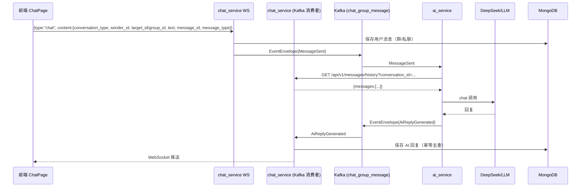

# 消息链路与字段传递文档

> 本文档描述“前端 → chat_service → Kafka → ai_service → Kafka → chat_service → 前端/存储”的完整链路。
> 所有字段以当前代码为准，后续改代码请同步更新本文档。

## 1. 总链路图



---

## 2. 前端 WebSocket 发送（FE → chat_service）

外层结构（[ws_message.go](../services/chat_service/app/api/models/ws_message.go)）：

```json
{
  "type": "chat",
  "content": {
    "conversation_type": "private | group | ai | ai-research",
    "sender_id": "用户ID",
    "target_id": "私聊接收者ID（私聊必填）",
    "group_id": "群ID（群聊/AI 会话必填）",
    "text": "消息文本",
    "message_id": "客户端生成的唯一ID，如 123-1690000000000",
    "message_type": "text",
    "conversation_id": "AI 会话ID（可选）"
  }
}
```

| 字段 | 类型 | 说明 |
| --- | --- | --- |
| `type` | string | 固定 `"chat"`；心跳为 `"ping"` |
| `content.conversation_type` | string | `private` / `group` / `ai` / `ai-research` |
| `content.sender_id` | string | 发送者用户 ID |
| `content.target_id` | string | 私聊接收者 ID |
| `content.group_id` | string | 群 ID / AI 会话 ID |
| `content.text` | string | 消息文本 |
| `content.message_id` | string | 消息 ID（去重/溯源用） |
| `content.message_type` | string | 消息类型（`text` 等） |

> 注意：前端发的是 `text`，不是 `content`；`content` 是外层载荷的键名。

---

## 3. chat_service 处理与 Mongo 落库

### 3.1 用户消息处理（[chat_message_service.go](../services/chat_service/app/services/chat_message_service.go)）

1. 校验 `content.Text` 非空。
2. **群聊 / AI 会话**：`SaveMessage(conversationType, senderID, groupID, msg)`，`targetID` 位置传群 ID。
3. **私聊**：`SaveMessage("private", senderID, targetID, msg)`。
4. 构造 `MessageSent` 发送 Kafka，分区 key：
   - 群聊：`getGroupPartitionKey(groupID)`（群 ID 数字部分奇偶分区）
   - 私聊：`targetID`

### 3.2 Mongo Message 结构（[models.go](../services/chat_service/app/database/mongodb/models.go)）

消息落库统一使用 `Message`，同时是历史接口返回的 JSON 结构：

| Mongo/JSON 字段 | 类型 | 说明 |
| --- | --- | --- |
| `sender_id` | string | 发送者 ID |
| `timestamp` | string(RFC3339) | 时间戳 |
| `timestamp_ms` | int64 | AI 生成时间戳（毫秒，可选） |
| `content` | string | 文本内容 |
| `metadata` | map | 可扩展元数据（AI 报告摘要等，可选） |
| `private_id` | string | 私聊接收者 ID（仅私聊） |
| `group_id` | string | 群 ID（仅群聊/AI） |
| `message_id` | string | 消息 ID |
| `conversation_id` | string | AI 会话 ID（可选） |
| `message_type` | string | 消息类型 |
| `is_active` | bool | 是否可见 |
| `read` | bool | 是否已读 |

### 3.3 Mongo 分桶规则

- 群聊集合：`group_message_history_YYYYMM`
- 私聊集合：`private_message_history_YYYYMM`
- 文档内 `date_identifier`：`YYYYMMDD`
- 私聊会话 ID：`GenerateSessionID(userA, userB)`，即两个用户 ID **排序后**用 `_` 拼接，例如 `ai-assistant_smoke-user`
- 写入幂等：更新条件带 `messages.message_id: {$ne: message_id}`，重放/重试不会重复插入

---

## 4. Kafka 事件信封（EventEnvelope）

定义见 [envelope.proto](../proto/chant/common/v1/envelope.proto)：

| 字段 | 类型 | 说明 |
| --- | --- | --- |
| `event_id` | string | 事件唯一 ID |
| `event_type` | string | `chant.chat.v1.MessageSent` / `chant.chat.v1.AiReplyGenerated` |
| `source` | string | 来源服务：`chat-service` / `ai-service` |
| `timestamp` | int64 | 事件产生时间（Unix 毫秒） |
| `trace_id` | string | 分布式追踪 ID（可选） |
| `data` | bytes | 载荷 protojson 序列化后的字节 |

Kafka topic：`chat_group_message`。

---

## 5. MessageSent（用户消息事件）

定义见 [event.proto](../proto/chant/chat/v1/event.proto)：

| 字段 | 类型 | 说明 |
| --- | --- | --- |
| `sender_id` | string | 发送者 ID |
| `target_user_id` | string | 私聊目标 ID |
| `group_id` | string | 群/AI 会话 ID |
| `content` | string | 文本内容 |
| `message_id` | string | 消息 ID |
| `message_type` | string | `text` 等 |
| `conversation_type` | string | `private` / `group` / `ai` / `ai-research` |
| `timestamp_ms` | int64 | 毫秒时间戳 |
| `metadata` | map<string,string> | 扩展字段 |

---

## 6. ai_service 消费与分发（[main.py](../services/ai_service/main.py)）

按 `event_type` 分发：

| 条件 | 处理函数 | 模式 |
| --- | --- | --- |
| `conversation_type == "ai-research"` 或 `target_user_id == ai-research` | `handle_agent_message` | agent 研究模式 |
| `target_user_id == ai-assistant` 或 `group_id` 以 `ai_` 开头 | `handle_private_message` | chat 对话模式 |
| `event_type == AiReplyGenerated` | 忽略 | 防循环 |

---

## 7. chat 模式处理（[chat/service.py](../services/ai_service/chat/service.py)）

输入字段：`sender_id`、`target_user_id`、`content`、`message_id`、`group_id`。

### 7.1 历史拉取（关键字段）

```
GET {chat_service_url}/api/v1/messages/history
  ?conversation_id=<conversation_id>
  &limit=30
  &cursor=<当前 Unix 秒>
```

`conversation_id` 取值规则：

| 场景 | conversation_id |
| --- | --- |
| 群聊 / AI 群 | `group_id`（AI 群以 `ai_` 开头） |
| 私聊 | 双方 ID 排序后拼接：`"_".join(sorted([target_user_id, sender_id]))`，例如 `ai-assistant_smoke-user` |

> 私聊不能只传单个用户 ID（如 `ai-assistant`），否则接口返回 200 但查不到记录。

### 7.2 处理流程

1. 拉取历史（失败只告警，不阻断）。
2. 将历史与当前消息写入进程内滑动窗口（`SlidingWindowMemory`，键为 `user_id`）。
3. 调用 LLM（`route_chat`，带重试）。
4. 成本记录（失败只告警）。
5. `send_ai_reply` 发送回复。

---

## 8. agent 模式处理（[agent/service.py](../services/ai_service/agent/service.py)）

输入字段：`sender_id`、`content`、`message_id`、`group_id`。

Agent 会流式发送多类消息，`message_id` 规则：

| 消息 | message_id | 说明 |
| --- | --- | --- |
| 进度消息 | `ai-progress-<原 message_id>` | 如“正在分析您的问题...” |
| 最终报告 | `ai-<原 message_id>` | 带 `metadata`（report_type/domain/methodology/summary） |
| 审稿意见 | `ai-<原 message_id>-critique` | 审核未通过时追加 |
| 错误回复 | `ai-err-<原 message_id>` | 异常兜底 |

---

## 9. AiReplyGenerated（AI 回复事件）

定义见 [event.proto](../proto/chant/chat/v1/event.proto)，构造见 [producer.py](../services/ai_service/shared/kafka/producer.py)：

| 字段 | 来源 | 说明 |
| --- | --- | --- |
| `sender_id` | 固定 | `ai-assistant` |
| `target_user_id` | 原消息 sender | 回复给谁 |
| `content` | LLM 输出 | 回复正文 |
| `reply_to_msg_id` | 原消息 message_id | 回复哪条 |
| `message_id` | `ai-<原 message_id>` | 回复消息 ID |
| `group_id` | 原消息 group_id | 群聊时非空 |
| `conversation_type` | 未设置 | 当前留空 |
| `timestamp_ms` | 当前时间 | 毫秒 |
| `metadata` | 报告元数据 | agent 模式使用 |

Kafka key：`target_user_id`（即原用户 ID）。

---

## 10. chat_service 消费 AI 回复（[event_consumer.go](../services/chat_service/app/infrastructure/kafka/event_consumer.go)）

1. 解析 `AiReplyGenerated`。
2. **群聊**：`GroupID = reply.group_id`、`ConversationID = reply.group_id`，按 `"ai"` 类型落 Mongo 群聊集合。
3. **私聊**：`PrivateID = reply.target_user_id`，按 `"private"` 类型落 Mongo 私聊集合。
4. WebSocket 推送 JSON：

```json
{
  "type": "private_chat",
  "sender": "ai-assistant",
  "content": "回复内容",
  "time": 1690000000000
}
```

---

## 11. 历史接口（GET /api/v1/messages/history）

入口：[message_handler.go](../services/chat_service/app/api/handlers/message_handler.go)

### 请求参数

| 参数 | 类型 | 说明 |
| --- | --- | --- |
| `conversation_id` | string | 必填；群=group_id，AI 群=`ai_` 开头，私聊=排序会话 ID |
| `cursor` | int64 | Unix 秒，往前翻页 |
| `start_time` / `end_time` | int64 | 时间范围（Unix 秒） |
| `keyword` | string | 内容关键字 |
| `limit` | int | 默认 100 |

### 响应

```json
{
  "messages": [
    {
      "sender_id": "ai-assistant",
      "timestamp": "2026-08-07T06:44:08.073Z",
      "timestamp_ms": 1786085035774,
      "content": "10+10等于20。",
      "private_id": "smoke-clean",
      "group_id": "",
      "message_id": "ai-clean2-1786085212650",
      "message_type": "text",
      "is_active": true,
      "read": false
    }
  ]
}
```

> 读取按“月集合名去重”，避免同一个月被重复查询导致历史消息重复。

---

## 12. 已知问题 / 注意事项

1. ~~**群聊 AI 回复推送**~~ **已修复**：群聊回复现在会查询群成员并逐个推送，推送 JSON 带 `type: "group_chat"` 和 `group_id`，已用 WebSocket 实测通过。
2. **历史接口未鉴权**：`GET /api/v1/messages/history` 是内部接口但没有鉴权，可遍历任意会话。
3. ~~**成本表分区缺失**~~ **已修复**：ai_service 启动时会自动补建当月与下月分区（`{table}_{YYYYMM}`），成本写入已实测通过。
4. **chat 模式记忆在进程内**：`_memories` 是进程内字典，重启丢失、多实例不共享。
5. **Kafka 直接注入 MessageSent 不会落用户消息**：用户消息落库发生在 WS 处理阶段；绕过 WS 直接发 Kafka 只有 AI 回复会被 chat_service 落库。
6. **kafka-ui 端口**：当前 compose 中 kafka-ui 使用 `8083`，避免与 chat_service 的 `8080` 冲突。
