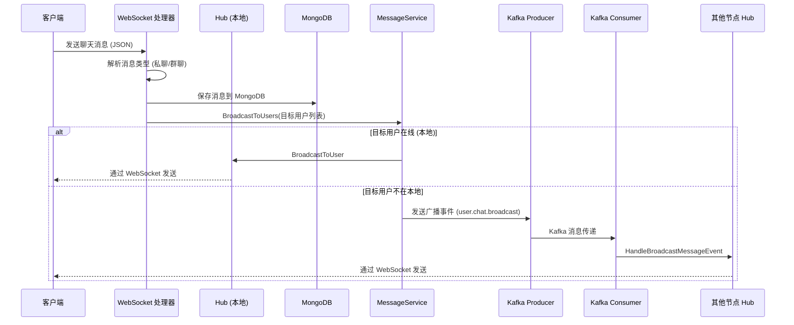

# 聊天消息发送逻辑分析

## 概述

`services/user_service` 是一个基于 Go 的微服务，负责处理用户聊天消息的发送、存储和广播。本服务采用 WebSocket 进行实时通信，结合 Kafka 实现分布式消息路由，使用 MongoDB 持久化聊天记录，通过 Hub 模式管理在线用户连接。

## 逻辑链路图

以下序列图描述了从客户端发送消息到接收者收到消息的完整流程：

**私聊消息** 的路径类似，但使用 `SendMessageToUser` 和 `user.chat.message` 事件。

## 关键组件说明

| 组件 | 文件 | 职责 |
|------|------|------|
| **WebSocket 入口** | [`websocket.go`](services/user_service/app/api/v1/websocket.go) | 处理 WebSocket 连接升级、消息接收、调用 `handleChat` |
| **Hub 管理器** | [`group_hub.go`](services/user_service/app/api/utils/group_hub.go) | 维护在线用户连接映射，提供广播、踢人等接口 |
| **消息服务** | [`message_service.go`](services/user_service/app/services/message_service.go) | 核心路由逻辑：本地优先发送，失败则转发 Kafka |
| **Kafka 生产者** | [`event_producer.go`](services/user_service/app/infrastructure/kafka/event_producer.go) | 包装 SDK，发送业务事件到 Kafka |
| **Kafka 消费者** | [`consumer_runner.go`](services/user_service/app/infrastructure/kafka/consumer_runner.go) | 启动消费者，注册事件处理器 |
| **事件处理器** | [`event_consumer.go`](services/user_service/app/infrastructure/kafka/event_consumer.go) | 根据事件类型路由到对应的处理函数 |
| **消息持久化** | [`chat_history.go`](services/user_service/app/database/mongodb/chat_history.go) | 统一保存消息到 MongoDB（分桶存储） |
| **模型定义** | [`message_model.go`](services/user_service/app/models/message_model.go) | 定义分布式消息和广播消息的结构 |

## 核心流程步骤

1. **连接建立**：客户端通过 `GET /api/v1/ws?user_id=...` 建立 WebSocket 连接，Hub 注册该用户。
2. **消息接收**：客户端发送 JSON 消息，格式为 `{"type":"chat","content":{...}}`。
3. **消息解析**：`handleChat` 解析 `content`，识别会话类型（私聊/群聊），获取目标用户列表。
   - 私聊：目标用户为 `TargetID`。
   - 群聊：通过 PostgreSQL 查询群组成员列表。
4. **消息存储**：构造 `Message` 对象，调用 `SaveMessage` 存入 MongoDB（按日期分桶）。
5. **消息广播**：
   - 调用 `MessageService.BroadcastToUsers`，传入目标用户列表和序列化的消息。
   - 对于每个目标用户：
     - 检查是否在线（`Hub.IsUserOnline`）。
     - 如果在线且连接在本节点，直接通过 `Hub.BroadcastToUser` 发送。
     - 如果不在本节点，将用户加入“远程列表”。
   - 若远程列表非空，打包发送 Kafka 广播事件 `user.chat.broadcast`。
6. **分布式投递**：
   - 其他节点的 Kafka 消费者收到广播事件，调用 `HandleBroadcastMessageEvent`。
   - 在该节点尝试通过本地 Hub 发送给目标用户。
   - 如果用户仍不在该节点，则忽略（用户可能离线）。
7. **私聊特殊处理**：若目标用户仅一人，使用 `SendMessageToUser` 逻辑，失败时发送 `user.chat.message` 事件。

## 推荐的阅读顺序

为全面理解聊天消息发送逻辑，建议按以下顺序阅读代码文件：

1. **入口与整体流程**
   - [`main.go`](services/user_service/main.go) – 服务启动、初始化数据库、Kafka、消费者。
   - [`router.go`](services/user_service/app/api/v1/router.go) – 路由注册，找到 WebSocket 端点。

2. **WebSocket 连接处理**
   - [`websocket.go`](services/user_service/app/api/v1/websocket.go) – WebSocket 连接处理、消息分发。
   - [`websocket_handler.go`](services/user_service/app/api/utils/websocket_handler.go) – WebSocket 连接包装器、读循环。
   - [`group_hub.go`](services/user_service/app/api/utils/group_hub.go) – Hub 和 Client 实现，管理在线用户。

3. **消息处理逻辑**
   - [`message_model.go`](services/user_service/app/models/message_model.go) – 消息结构定义。
   - [`const.go`](services/user_service/app/infrastructure/kafka/const.go) – 事件类型、消息类型常量。
   - 回顾 `websocket.go` 中的 `handleChat` 函数。

4. **消息持久化**
   - [`chat_history.go`](services/user_service/app/database/mongodb/chat_history.go) – 统一保存入口。
   - [`mongodb_group_message_history_service.go`](services/user_service/app/database/mongodb/mongodb_group_message_history_service.go) – 群聊消息存储（含 Message 结构）。
   - [`mongodb_private_message_history_service.go`](services/user_service/app/database/mongodb/mongodb_private_message_history_service.go) – 私聊消息存储。

5. **消息服务与广播**
   - [`message_service.go`](services/user_service/app/services/message_service.go) – `BroadcastToUsers`、`SendMessageToUser` 等核心方法。
   - [`event_producer.go`](services/user_service/app/infrastructure/kafka/event_producer.go) – Kafka 生产者包装器。

6. **Kafka 消费者与事件处理**
   - [`consumer_runner.go`](services/user_service/app/infrastructure/kafka/consumer_runner.go) – 消费者运行器。
   - [`event_consumer.go`](services/user_service/app/infrastructure/kafka/event_consumer.go) – 事件处理器路由。
   - 回顾 `message_service.go` 中的 `HandleChatMessageEvent` 和 `HandleBroadcastMessageEvent`。

7. **辅助组件**（按需）
   - [`events.go`](services/user_service/app/models/events.go) – 其他事件结构。
   - [`event_handler.go`](services/user_service/app/handlers/event_handler.go) – 用户事件处理（非核心）。
   - [`event_handlers.go`](services/user_service/app/infrastructure/kafka/services/event_handlers.go) – 其他事件处理。

8. **配置与数据库**（按需）
   - [`config.go`](services/user_service/app/config/config.go) – 配置结构。
   - [`psql_user_service.go`](services/user_service/app/database/pgsql/psql_user_service.go) – 用户服务（用于获取群组成员）。

## 关键设计要点

- **本地优先**：消息优先通过本地 Hub 发送，减少 Kafka 负载和延迟。
- **分布式广播**：若用户不在本地，通过 Kafka 事件让其他节点尝试发送。
- **消息顺序**：私聊消息使用 `TargetUserID` 作为 Kafka 消息 Key，保证同一用户的私聊消息顺序。
- **分桶存储**：MongoDB 按群组和日期分桶，避免单个文档过大。
- **单端登录**：Hub 在注册新连接时会踢掉同一用户的旧连接。

## 后续开发建议

- **消息可靠性**：当前 Kafka 事件发送后未确认是否被消费，可考虑增加重试或死信队列。
- **离线消息**：若用户在所有节点均离线，可考虑存入待推送队列，待上线后补发。
- **消息状态回执**：可扩展消息模型，支持已读、已送达状态。

---

*本总结基于 `services/user_service` 代码库分析，适用于版本 `v1.0.0`。*